# 業界横断 統合業務ハブ + AI問い合わせ機能 — Demo

中小企業の経営者が「Excel + メール + 紙の請求書」で管理している業務を、1つのWebアプリに統合したデモシステムです。商談から入金まで（顧客 → 案件 → 見積 → 請求 → 入金）を一気通貫で扱えます。

業種切替（IT受託 / 卸売 / コンサル）で異なるサンプルデータを瞬時に投入でき、AIに自然言語で「今月の売上は？」「未入金一覧」「TOP顧客は？」と尋ねると、localStorage 上の業務データを集計して回答します（実LLM API は使わずキーワードマッチング + 集計）。

## 公開URL

- 本番: https://demo.katsuya-suzuki.dev/business-hub *（Vercel連携後に公開）*

## スクリーンショット

### ダッシュボード（業種3種）

業種ごとに「今月売上 / 未入金 / 商談中 / 新規顧客」が連動して切り替わります。

#### 卸売・小売
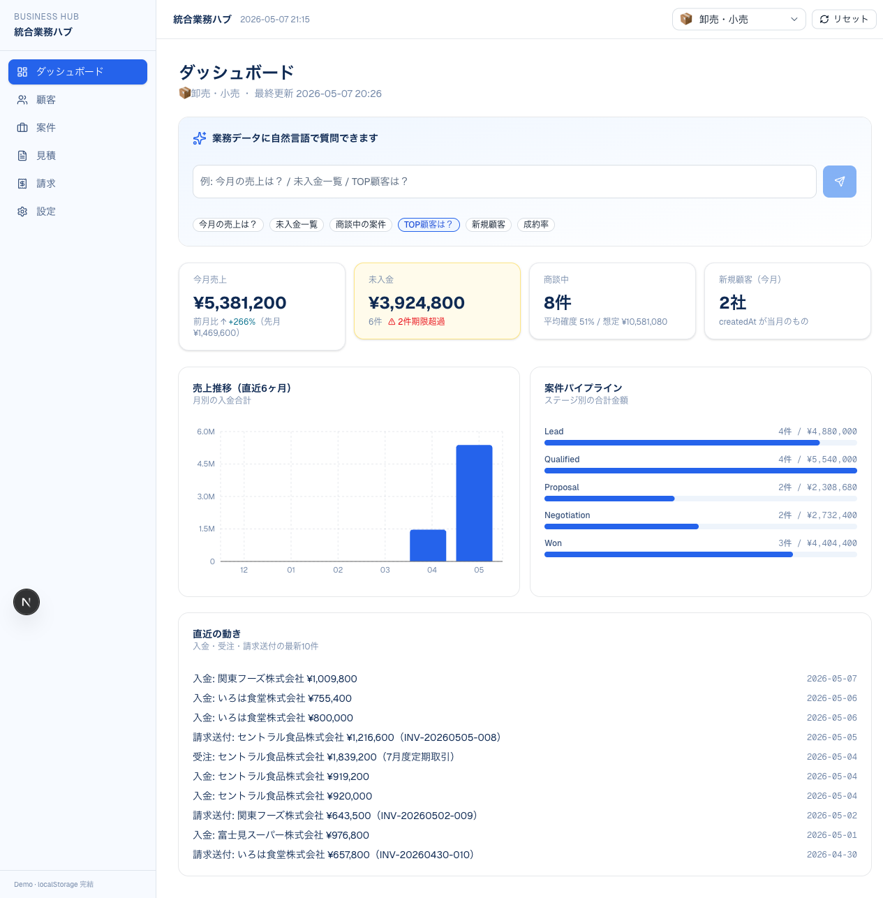

#### IT受託・SaaS
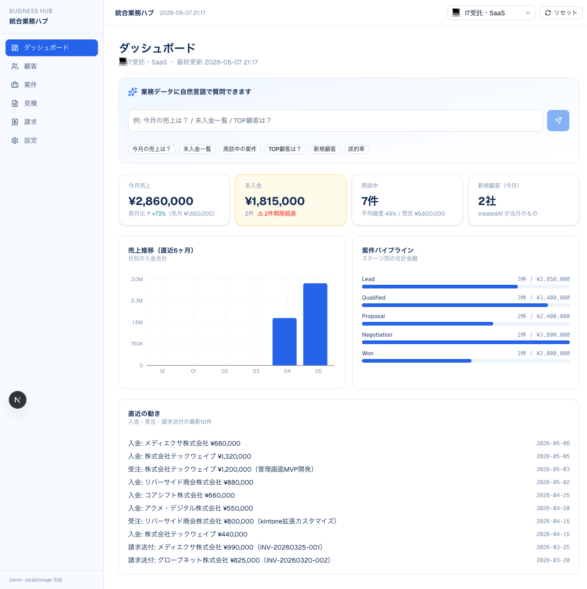

#### コンサル・士業
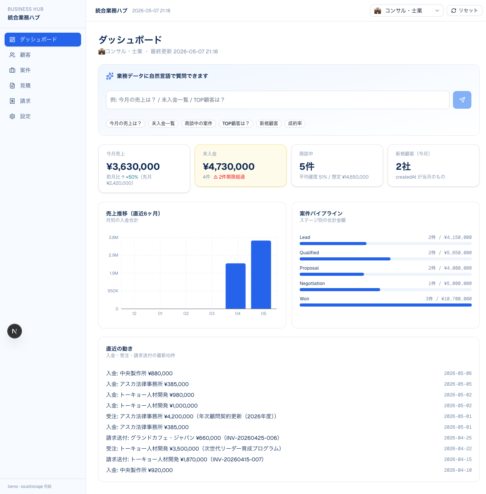

### AI 問い合わせ（自然言語で業務データを呼び出し）

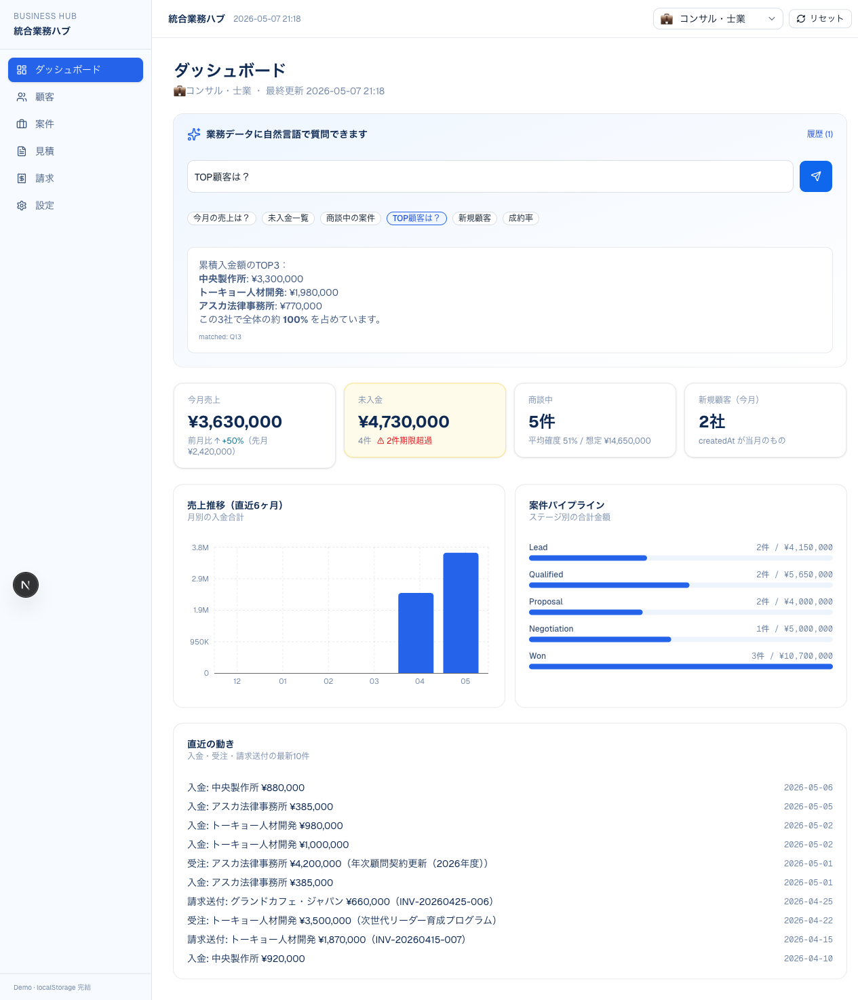

「TOP顧客は？」「未入金一覧」「今月の売上は？」など 18 パターンに対応。実 LLM は使わず、キーワードマッチング + zustand store 上の集計で回答します。

### 案件カンバン（D&D でステージ移動）

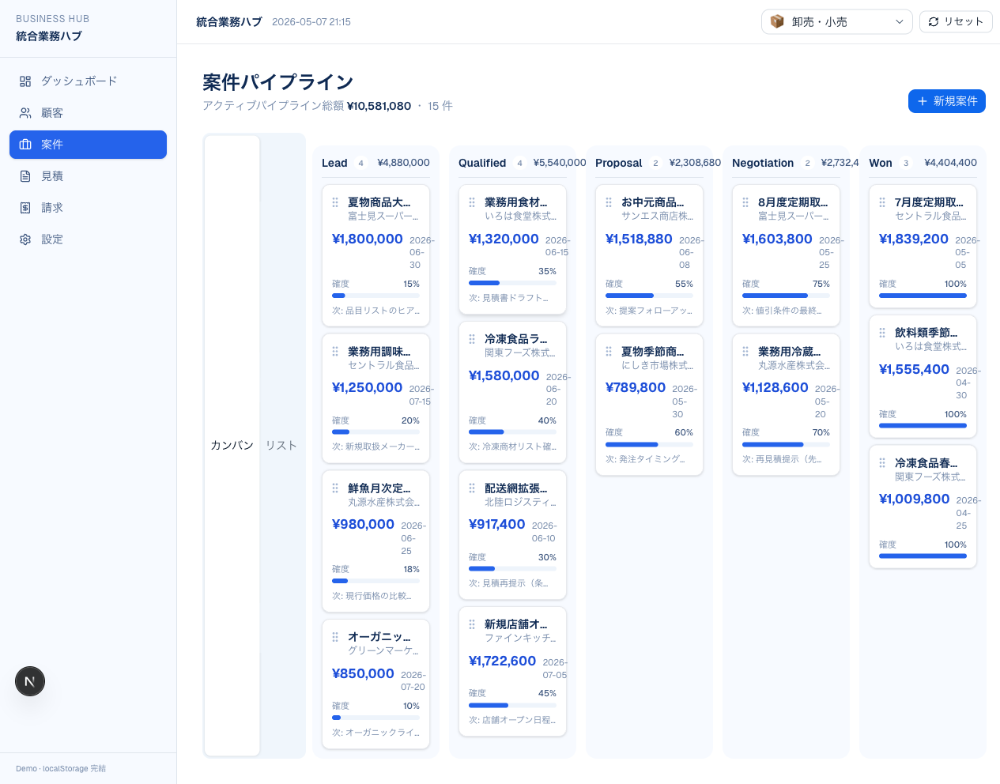

### 見積：一覧・詳細・印刷プレビュー

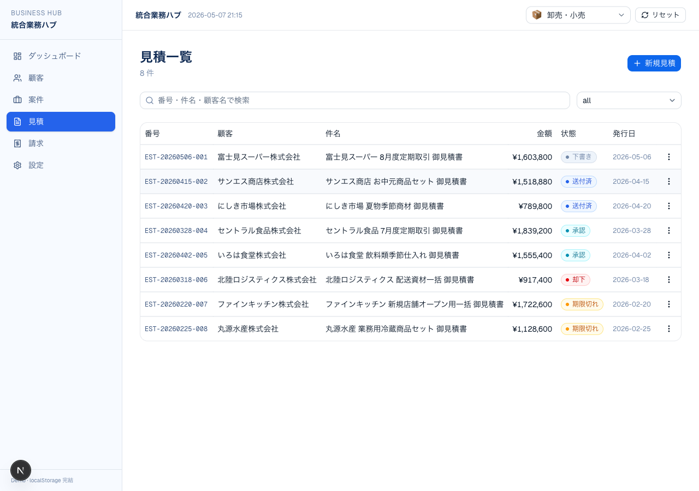
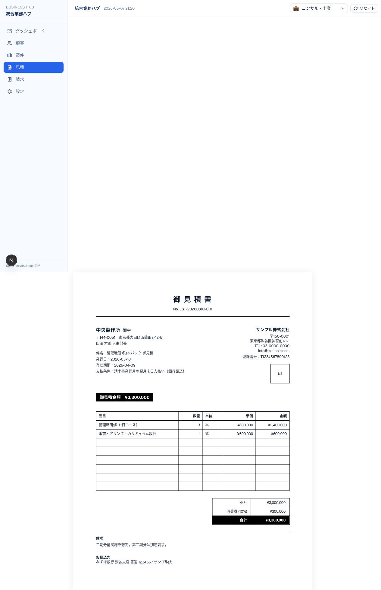

### 請求：一覧（サマリーカード3枚）・印刷プレビュー

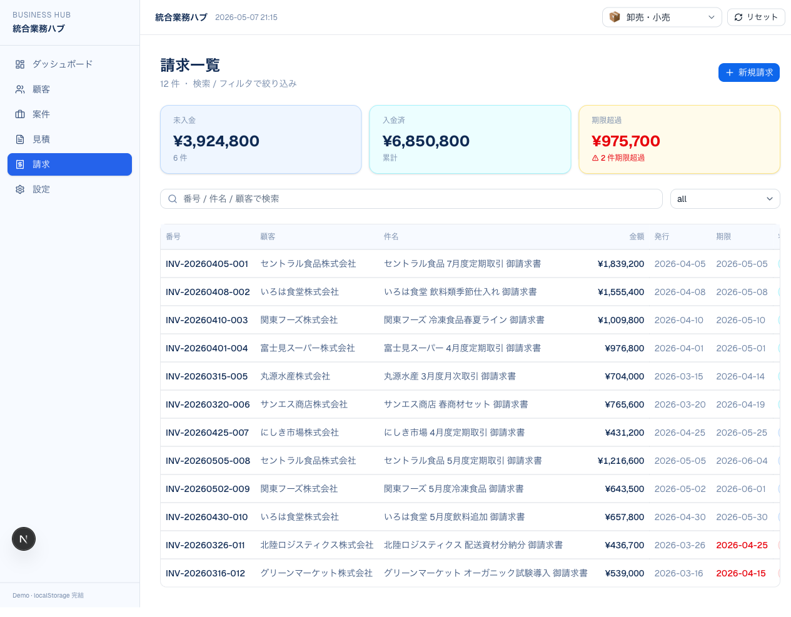
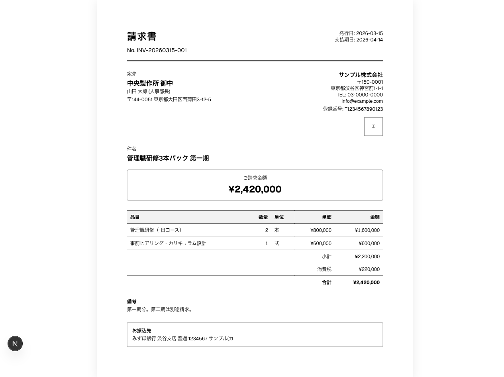

### 顧客 / 設定

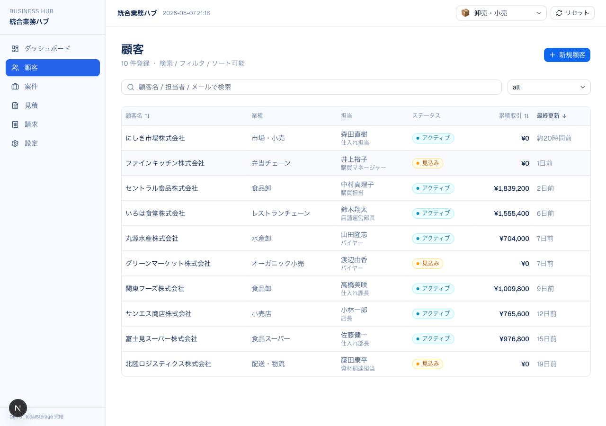
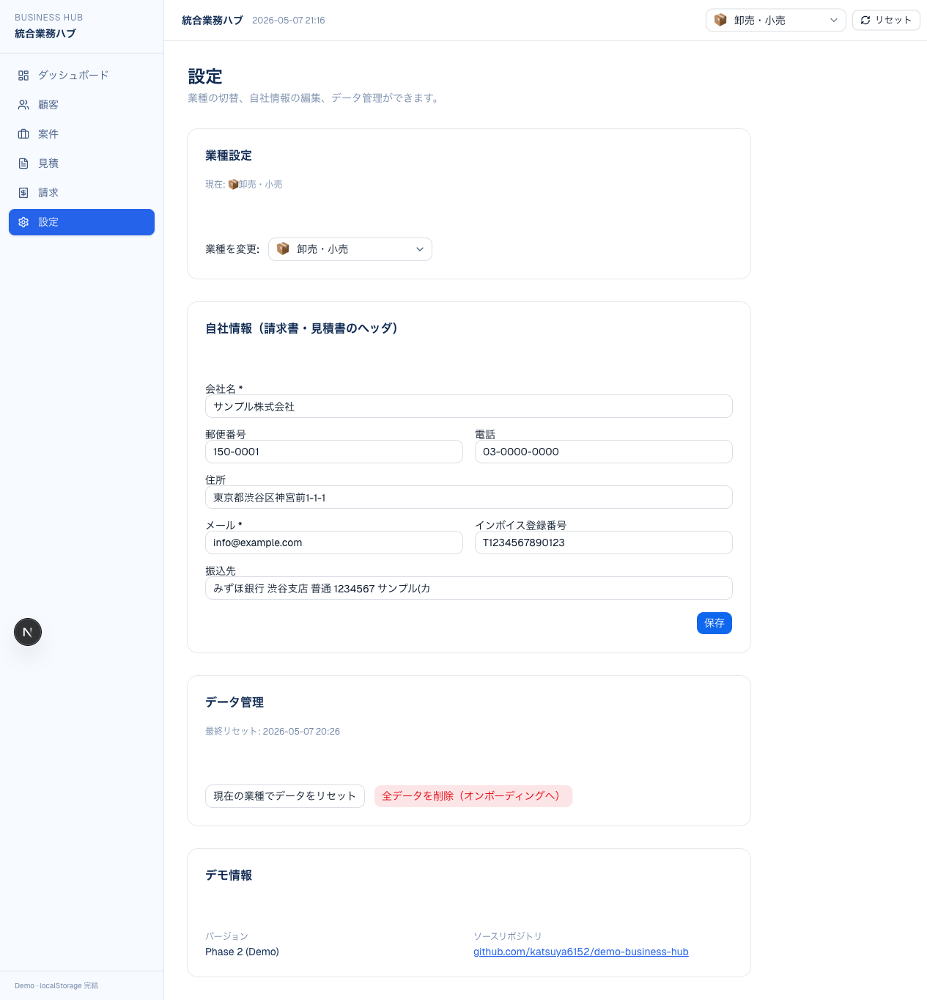

## 技術スタック

| カテゴリ | 採用 |
|---|---|
| フレームワーク | Next.js 16 (App Router) + TypeScript |
| スタイリング | Tailwind CSS v4 + shadcn/ui (`@base-ui/react`) |
| アイコン | lucide-react |
| グラフ | Recharts |
| カンバン D&D | @dnd-kit/core + sortable |
| 状態管理 | zustand + persist (localStorage) |
| フォーム | react-hook-form + zod |
| 日付 | date-fns |
| Markdown | react-markdown |
| 通知 | sonner |
| テスト | vitest + @testing-library/react + jsdom |
| パッケージ管理 | pnpm |

## 起動方法

```bash
pnpm install
pnpm dev          # http://localhost:3000
```

## スクリプト

| コマンド | 用途 |
|---|---|
| `pnpm dev` | 開発サーバー起動 |
| `pnpm build` | 本番ビルド |
| `pnpm start` | 本番サーバー起動 |
| `pnpm lint` | ESLint |
| `pnpm typecheck` | TypeScript 型チェック |
| `pnpm test` | Vitest 単発実行 |
| `pnpm test:watch` | Vitest watch モード |

## ディレクトリ構成

```
src/
├── app/                # Next.js App Router
│   ├── customers/      # 顧客一覧・詳細
│   ├── deals/          # 案件パイプライン・詳細
│   ├── quotes/         # 見積一覧・新規・詳細
│   ├── invoices/       # 請求一覧・新規・詳細
│   ├── settings/       # 業種切替・自社情報・データ管理
│   ├── globals.css     # 配色トークン・@theme inline
│   └── print.css       # 印刷用CSS
├── components/
│   ├── ui/             # shadcn/ui (button / dialog / sheet ...)
│   ├── layout/         # AppShell / Sidebar / Header / IndustrySwitcher
│   ├── dashboard/      # KPIカード / 売上推移 / パイプライン / AI問い合わせバー
│   ├── customers/, deals/, quotes/, invoices/  # 各ドメインの画面コンポーネント
│   └── shared/         # ConfirmDialog / EmptyState / StatCard / StatusBadge
├── lib/
│   ├── types/          # Customer / Deal / Quote / Invoice / Payment / Settings
│   ├── store/          # zustand stores (entity ごと、persist 個別キー)
│   ├── seeds/          # 業種別サンプルデータ（it-services / wholesale / consulting）
│   ├── utils/          # 集計ヘルパー / 通貨 / 日付 / 番号採番
│   └── ai/             # 18パターン定義 / matcher / responder
└── hooks/              # use-industry / use-mounted
```

## データの扱い

- 完全モック。実DB・実LLM・認証なし
- データは `localStorage`（zustand persist）に保存
- 各ストア独立キー（例: `business-hub-customers-v1`）
- 業種切替・データリセットは設定画面・ヘッダから可能

## AI 問い合わせ機能の仕組み

1. ユーザーが自然言語で入力
2. `src/lib/ai/matcher.ts` がトリガーキーワード一致数 + priority で 18 パターンから最適な質問パターンを選ぶ
3. `src/lib/ai/responder.ts` が選ばれたパターンに対応する集計関数を呼んでマークダウンの回答を生成
4. UI でローディング演出 (600〜1200ms) を経て、`react-markdown` で表示

## デプロイ構成

`https://demo.katsuya-suzuki.dev/business-hub` で公開する前提で `next.config.ts` に
`basePath: "/business-hub"` を設定済み。`NEXT_PUBLIC_BASE_PATH` 環境変数で上書き可能。

### Vercel 設定（Web UI から行う想定）

1. **Import Project**: GitHub リポジトリを Vercel で Import
2. **Framework**: Next.js（自動検出）
3. **Build Command**: `pnpm build`（プリセット）
4. **Install Command**: `pnpm install`
5. **Node.js Version**: 20.x 以上
6. **環境変数**: 不要（モック実装のため）。サブパスを変える場合のみ `NEXT_PUBLIC_BASE_PATH` を設定。
7. **Custom Domain**: `demo.katsuya-suzuki.dev` を追加

### Cloudflare DNS 設定

Vercel が指示する CNAME ターゲット（通常 `cname.vercel-dns.com`）を Cloudflare に登録:

| Type | Name | Target | Proxy |
|---|---|---|---|
| CNAME | demo | `cname.vercel-dns.com` | DNS only（オレンジ雲オフ）推奨 |

> **Proxy オン（オレンジ雲）にすると Vercel の自動 HTTPS 発行が失敗するため、初回検証は DNS only で行う。** 落ち着いてから Proxy オン + "Full (Strict)" SSL に切り替え可能。

### 以降のデプロイ

GitHub `main` ブランチへの push で Vercel が自動デプロイ。

## 完了の定義

- [x] `pnpm dev` で全画面動作（Playwright で確認済）
- [x] `pnpm build` 通過
- [x] `pnpm test` 全 pass
- [x] `pnpm lint` 警告ゼロ
- [x] `pnpm typecheck` エラーゼロ
- [x] GitHubリポジトリ作成済 / push済
- [x] README に Vercel デプロイ手順記載
- [x] スクリーンショット保存済（`public/screenshots/`）
- [x] AI 18パターンの動作（最低 10 ケース Playwright 検証）
- [x] レスポンシブ動作確認（375 / 768 / 1280）
- [x] console / network エラーゼロ最終確認

## ライセンス

このリポジトリはデモ目的で公開しています。
